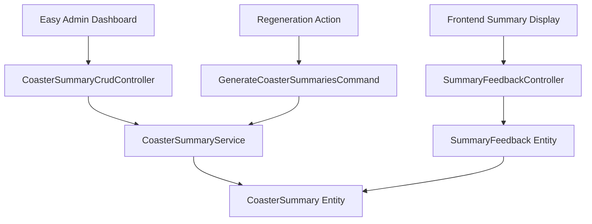

# Design Document

## Overview

This design enhances the existing AI summary system by adding two key components: an Easy Admin dashboard interface for summary management and a user feedback system to track summary quality. The solution integrates seamlessly with the existing Symfony/EasyAdmin architecture while maintaining performance and user experience standards.

## Architecture

### High-Level Components



### Data Flow

1. **Admin Management Flow**: Admin users access summaries through EasyAdmin → CoasterSummaryCrudController → CoasterSummaryService
2. **User Feedback Flow**: End users provide feedback → SummaryFeedbackController → SummaryFeedback entity → Updates CoasterSummary metrics
3. **Regeneration Flow**: Admin triggers regeneration → Custom action → GenerateCoasterSummariesCommand → CoasterSummaryService

## Components and Interfaces

### 1. Database Schema Extensions

#### New Entity: SummaryFeedback
```php
class SummaryFeedback
{
    private ?int $id;
    private CoasterSummary $summary;
    private ?User $user;           // Nullable for anonymous feedback
    private string $ipAddress;     // For anonymous user tracking
    private bool $isPositive;      // true = thumbs up, false = thumbs down
    private \DateTimeInterface $createdAt;
    private ?\DateTimeInterface $updatedAt;
}
```

#### CoasterSummary Entity Extensions
```php
class CoasterSummary
{
    // Existing properties...
    
    private int $positiveVotes = 0;
    private int $negativeVotes = 0;
    private float $feedbackRatio = 0.0;  // Updated when feedback is submitted
    
    // New methods for feedback management
    public function updateFeedbackMetrics(): void;  // Called after feedback changes
    public function getFeedbackRatio(): float;
    public function getTotalVotes(): int;
    public function hasMinimumFeedback(int $minVotes = 10): bool;
    
    // Cascade delete relationship
    #[ORM\OneToMany(mappedBy: 'summary', targetEntity: SummaryFeedback::class, cascade: ['remove'])]
    private Collection $feedbacks;
}
```

### 2. Easy Admin Integration

#### CoasterSummaryCrudController
```php
class CoasterSummaryCrudController extends AbstractCrudController
{
    // Field configuration with feedback metrics
    public function configureFields(string $pageName): iterable;
    
    // Custom actions for regeneration
    public function configureActions(Actions $actions): Actions;
    
    // Filters for poor feedback ratios
    public function configureFilters(Filters $filters): Filters;
    
    // Custom regeneration action
    public function regenerateSummary(AdminContext $context): Response;
}
```

#### Admin Dashboard Features
- **Summary List View**: Display coaster name, language, feedback ratio, total votes, last updated
- **Feedback Ratio Highlighting**: Visual indicators for poor ratios with sufficient votes
- **Filtering Options**: Filter by feedback ratio, language, date ranges
- **Sorting**: Sort by feedback ratio, votes, creation date
- **Action Buttons**: Individual regeneration actions only

### 3. Frontend Feedback System

#### SummaryFeedbackController
```php
class SummaryFeedbackController extends AbstractController
{
    public function submitFeedback(Request $request, int $summaryId): JsonResponse;
}
```

#### Frontend JavaScript Component (Stimulus)
```javascript
// assets/controllers/summary_feedback_controller.js
export default class extends Controller {
    static targets = ["thumbsUp", "thumbsDown", "counter"];
    static values = { summaryId: Number };
    
    vote(event) {
        // Handle thumbs up/down voting via POST request
        // Update UI with response data (vote counts, user's current vote)
    }
}
```

### 4. Services and Business Logic

#### Enhanced CoasterSummaryService
```php
class CoasterSummaryService
{
    // Existing methods...
    
    public function regenerateSummaryById(int $summaryId): array;
    public function getSummariesWithPoorFeedback(float $threshold = 0.3, int $minVotes = 10): array;
}
```

#### New SummaryFeedbackService
```php
class SummaryFeedbackService
{
    public function submitFeedback(CoasterSummary $summary, ?User $user, string $ipAddress, bool $isPositive): SummaryFeedback;
    public function updateSummaryMetrics(CoasterSummary $summary): void;
}
```

## Data Models

### Database Tables

#### summary_feedback
```sql
CREATE TABLE summary_feedback (
    id INT AUTO_INCREMENT PRIMARY KEY,
    summary_id INT NOT NULL,
    user_id INT NULL,
    ip_address VARCHAR(45) NOT NULL,
    is_positive BOOLEAN NOT NULL,
    created_at DATETIME NOT NULL,
    updated_at DATETIME NULL,
    FOREIGN KEY (summary_id) REFERENCES coaster_summary(id) ON DELETE CASCADE,
    FOREIGN KEY (user_id) REFERENCES user(id) ON DELETE SET NULL,
    UNIQUE KEY unique_user_feedback (summary_id, user_id),
    UNIQUE KEY unique_anonymous_feedback (summary_id, ip_address),
    INDEX idx_summary_feedback (summary_id, is_positive)
);
```

#### coaster_summary (additions)
```sql
ALTER TABLE coaster_summary 
ADD COLUMN positive_votes INT DEFAULT 0,
ADD COLUMN negative_votes INT DEFAULT 0,
ADD COLUMN feedback_ratio DECIMAL(5,4) DEFAULT 0.0000,
ADD INDEX idx_feedback_ratio (feedback_ratio);
```

### API Endpoints

#### Feedback API
- `POST /summary/{id}/feedback` - Submit feedback (returns current vote counts)

## Error Handling

### Validation Rules
- **Feedback Submission**: Validate summary exists, prevent spam (rate limiting)
- **Admin Actions**: Verify admin permissions, validate summary IDs
- **Regeneration**: Handle AI service failures gracefully

### Error Scenarios
1. **AI Service Unavailable**: Display error message, log for retry
2. **Invalid Summary ID**: Return 404 with appropriate message
3. **Duplicate Feedback**: Update existing vote instead of creating new
4. **Rate Limiting**: Prevent spam with IP-based rate limiting

### Logging Strategy
- Log all feedback submissions with user/IP tracking
- Log regeneration attempts and results
- Log bulk operations progress and failures
- Monitor feedback ratio trends for quality insights

## Testing Strategy

### Unit Tests
- **SummaryFeedbackService**: Test feedback submission, vote changes, metrics calculation
- **CoasterSummaryService**: Test regeneration methods
- **Entity Methods**: Test feedback ratio calculations, vote counting

### Integration Tests
- **Admin Controller**: Test CRUD operations, custom actions
- **Feedback Controller**: Test feedback endpoint
- **Database Operations**: Test feedback persistence, summary updates, cascade deletes

### Frontend Tests
- **Stimulus Controller**: Test voting interactions, UI updates
- **Feedback Integration**: Test feedback submission, error handling

### Performance Tests
- **Command Enhancement**: Test performance with ratio-based filtering
- **Feedback Queries**: Test query performance with high vote counts
- **Admin Dashboard**: Test loading times with many summaries

## Security Considerations

### Authentication & Authorization
- **Admin Access**: Require ROLE_ADMIN for Easy Admin access
- **Feedback Submission**: Allow anonymous users with rate limiting
- **API Endpoints**: Implement CSRF protection for state-changing operations

### Data Protection
- **IP Address Storage**: Hash IP addresses for privacy
- **Anonymous Feedback**: Don't require user accounts for feedback
- **Rate Limiting**: Prevent abuse with IP-based throttling

### Input Validation
- **Summary IDs**: Validate integer format, existence
- **Feedback Values**: Validate boolean true/false only
- **Command Parameters**: Validate ratio thresholds and minimum vote counts