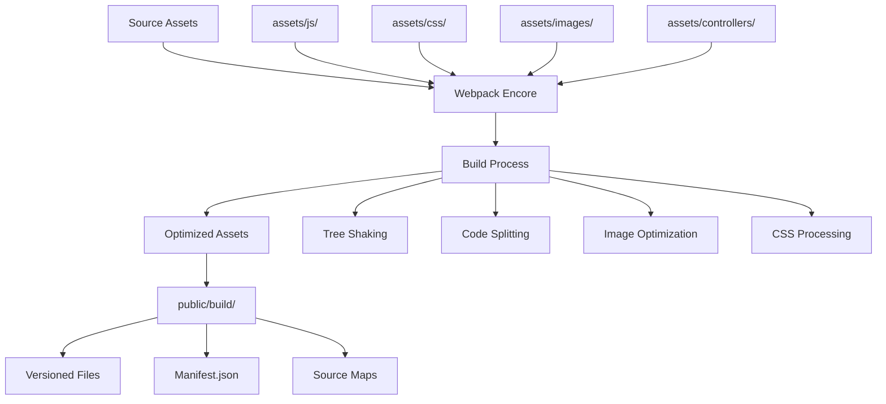
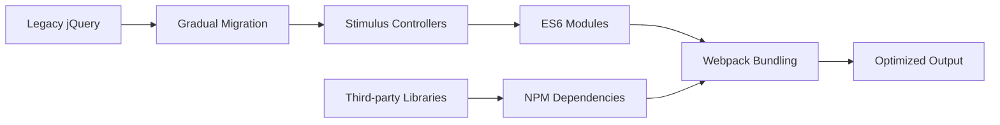

# Design Document

## Overview

The Webpack Encore modernization will transform Captain Coaster's asset system from a legacy template-based approach to a modern, maintainable build pipeline. The design focuses on eliminating build artifacts from version control, reducing bundle sizes through tree-shaking and dead code elimination, modernizing JavaScript dependencies, and implementing proper asset optimization.

The current system already has Webpack Encore configured but suffers from several issues: large CSS/JS files from a purchased template with minimal usage, jQuery dependencies in some controllers, potential unused images, and committed build artifacts. This modernization will address these issues while maintaining all existing functionality.

## Architecture

### Asset Pipeline Architecture



### Modern JavaScript Architecture



## Components and Interfaces

### 1. Build Configuration Component

**Purpose**: Central configuration for all asset processing
**Location**: `webpack.config.js`

**Key Features**:
- Multiple entry points for different page types
- Environment-specific optimizations
- Asset versioning and cache busting
- Source map generation for development
- Tree shaking and code splitting

**Configuration Structure**:
```javascript
// Entry points
.addEntry('app', './assets/js/app.js')           // Main application
.addEntry('coaster', './assets/js/coaster.js')   // Coaster-specific features
.addEntry('admin', './assets/js/admin.js')       // Admin interface (new)

// CSS processing - LESS support for template files
.enableLessLoader()                              // Enable LESS processing for template
.enablePostCssLoader()                           // Enable PostCSS for autoprefixing

// Optimization
.splitEntryChunks()                              // Code splitting
.enableSingleRuntimeChunk()                      // Runtime optimization
```

### 2. Asset Organization Component

**Purpose**: Logical organization of source assets
**Structure**:
```
assets/
├── js/
│   ├── app.js              # Main entry point
│   ├── coaster.js          # Coaster-specific functionality
│   ├── admin.js            # Admin interface (new)
│   └── modules/            # Reusable JS modules
├── styles/                 # New organized styles directory
│   ├── app.less            # Main stylesheet (selective template imports)
│   ├── components/         # Component-specific styles
│   ├── pages/              # Page-specific styles
│   └── custom/             # Custom overrides and additions
├── less/                   # Existing template LESS files (preserved)
│   ├── _bootstrap/         # Bootstrap template components
│   ├── bootstrap-limitless/ # Template framework files
│   ├── components/         # Template UI components
│   └── core/               # Template core styles
├── images/                 # Optimized images only
└── controllers/            # Stimulus controllers
```

### 3. Stimulus Controller System

**Purpose**: Modern JavaScript interactions without jQuery dependency
**Interface**: Standardized Stimulus controller pattern

**Controller Categories**:
- **Form Controllers**: Handle form interactions, validation, AJAX submissions
- **UI Controllers**: Manage modals, dropdowns, tooltips
- **Data Controllers**: Handle API calls, data fetching
- **Media Controllers**: Image galleries, lightboxes

**Example Controller Structure**:
```javascript
// assets/controllers/modal_controller.js
import { Controller } from "@hotwired/stimulus"

export default class extends Controller {
    static targets = ["modal", "backdrop"]
    static classes = ["show", "fade"]
    
    show() {
        // Modern modal implementation without jQuery
    }
    
    hide() {
        // Clean hide implementation
    }
}
```

### 4. CSS Processing Component

**Purpose**: Modern CSS processing and optimization leveraging existing LESS template files
**Technology**: LESS + PostCSS (maintaining template structure)

**Processing Pipeline**:
1. **LESS Compilation**: Utilize existing LESS files from assets/less directory
2. **Selective Import**: Import only used components from template LESS files
3. **PostCSS Processing**: Autoprefixing, optimization
4. **PurgeCSS Integration**: Remove unused CSS (careful implementation with template analysis)
5. **Critical CSS**: Inline critical styles for performance

**LESS Structure Utilization**:
```less
// assets/styles/app.less (new main file)
// Import only what we need from the template
@import '../less/_bootstrap/variables.less';
@import '../less/_bootstrap/mixins.less';
@import '../less/_bootstrap/grid.less';
@import '../less/_bootstrap/forms.less';
// ... selective imports based on usage analysis

// Custom overrides and additions
@import 'custom/variables';
@import 'custom/components';
@import 'custom/pages';
```

**Template LESS Analysis Strategy**:
- Analyze current CSS usage to identify which LESS components are actually needed
- Create a mapping between current CSS classes and LESS source files
- Implement selective compilation to include only used template components
- Maintain template structure for easier updates and maintenance

### 5. Image Asset Management

**Purpose**: Optimized image handling and unused asset cleanup
**Features**:
- Automatic image optimization
- WebP generation for modern browsers
- Unused image detection and removal
- Proper asset referencing in CSS/JS

**Implementation**:
```javascript
// webpack.config.js additions
.copyFiles({
    from: './assets/images',
    to: 'images/[path][name].[hash:8].[ext]',
    pattern: /\.(png|jpg|jpeg|gif|ico|svg|webp)$/
})
```

## Data Models

### Asset Manifest Model
```json
{
  "entrypoints": {
    "app": {
      "js": ["/build/runtime.js", "/build/app.js"],
      "css": ["/build/app.css"]
    },
    "coaster": {
      "js": ["/build/coaster.js"]
    }
  },
  "assets": {
    "app.js": "/build/app.a1b2c3.js",
    "app.css": "/build/app.d4e5f6.css"
  }
}
```

### Build Configuration Model
```yaml
# Configuration structure for different environments
development:
  source_maps: true
  optimization: false
  hot_reload: true
  
production:
  source_maps: false
  optimization: true
  versioning: true
  compression: true
```

## Error Handling

### Build Error Management
- **Compilation Errors**: Clear error messages with file locations
- **Asset Missing**: Graceful fallbacks for missing images/fonts
- **JavaScript Errors**: Source map support for debugging
- **CSS Errors**: Sass error reporting with line numbers

### Runtime Error Handling
```javascript
// Global error handler for asset loading
window.addEventListener('error', (e) => {
    if (e.target.tagName === 'SCRIPT' || e.target.tagName === 'LINK') {
        console.error('Asset loading failed:', e.target.src || e.target.href);
        // Implement fallback or retry logic
    }
});
```

### Development vs Production
- **Development**: Detailed error messages, source maps, hot reload
- **Production**: Minified assets, error logging, graceful degradation

## Testing Strategy

### Asset Build Testing
1. **Build Verification**: Ensure all assets compile without errors
2. **Bundle Analysis**: Verify bundle sizes are within acceptable limits
3. **Asset Integrity**: Check that all referenced assets exist
4. **Cross-browser Testing**: Verify assets work across target browsers

### JavaScript Testing
1. **Stimulus Controller Tests**: Unit tests for controller functionality
2. **Integration Tests**: Test asset loading and initialization
3. **Performance Tests**: Bundle size and load time verification

### CSS Testing
1. **Visual Regression**: Ensure styling remains consistent
2. **Responsive Testing**: Verify layouts across device sizes
3. **Accessibility Testing**: Check color contrast and focus states

### Migration Testing
1. **Feature Parity**: Ensure all existing functionality works
2. **Performance Comparison**: Before/after performance metrics
3. **Browser Compatibility**: Test across supported browsers

## Implementation Phases

### Phase 1: Foundation Setup
- Configure modern Webpack Encore setup
- Implement Sass processing
- Set up proper .gitignore for build artifacts

### Phase 2: JavaScript Modernization
- Migrate jQuery dependencies to Stimulus
- Implement ES6 modules
- Set up code splitting

### Phase 3: CSS Optimization
- Analyze current CSS usage against LESS template files
- Create selective LESS imports for only used components
- Implement component-based organization using template structure
- Remove unused template components and styles

### Phase 4: Asset Cleanup
- Identify and remove unused images
- Implement image optimization
- Clean up vendor files

### Phase 5: Performance Optimization
- Implement tree shaking
- Optimize bundle sizes
- Add performance monitoring

## Performance Considerations

### Bundle Size Targets
- **Main Bundle**: < 200KB gzipped
- **Vendor Bundle**: < 150KB gzipped
- **CSS Bundle**: < 100KB gzipped

### Loading Strategy
- **Critical CSS**: Inline above-the-fold styles
- **Lazy Loading**: Non-critical JavaScript
- **Preloading**: Important assets

### Caching Strategy
- **Long-term Caching**: Versioned assets with far-future expires
- **Cache Busting**: Automatic hash-based versioning
- **Service Worker**: Optional for advanced caching (future enhancement)

## Migration Strategy

### Backward Compatibility
- Maintain all existing functionality during migration
- Gradual migration of jQuery dependencies
- Fallback mechanisms for critical features

### Rollback Plan
- Keep current system functional during migration
- Feature flags for new asset system
- Quick rollback capability if issues arise

### Monitoring
- Build time monitoring
- Bundle size tracking
- Performance metrics comparison
- Error rate monitoring