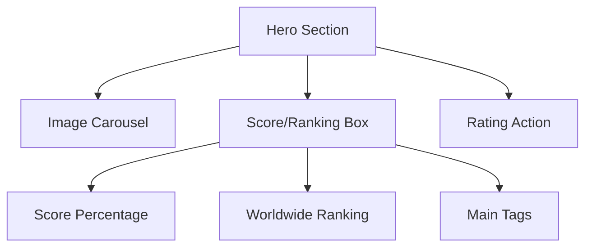
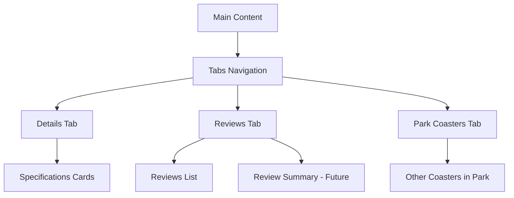

# Coaster View Page Redesign Plan

## Design Goals

1. Focus on the rating and ranking system as the primary feature
2. Showcase coaster images prominently
3. Display characteristics in a clear, organized manner
4. Present reviews with the ability to show more
5. Include space for a future review summary feature
6. Make rating action very visible and accessible
7. Create a modern, clean interface using Tailwind CSS and daisyUI components

## Page Structure

### 1. Hero Section

The top section will feature:

- A large hero component with a carousel of coaster images
- Prominent display of the coaster's score and worldwide ranking
- Main tags (pros/cons) displayed as badges
- Quick rating action button for logged-in users



### 2. Main Content Section

The main content will be organized using tabs:



#### Details Tab

- Technical specifications displayed in a grid of cards
- Information organized by categories (dimensions, manufacturer, etc.)
- Visual indicators for key stats (height, speed, length, inversions)

#### Reviews Tab

- Review summary section (placeholder for future feature)
- Top 5 reviews displayed initially
- "Show more" button to load additional reviews
- Filter options for reviews

#### Park Coasters Tab

- List of other coasters in the same park
- Quick links to view those coasters

### 3. Sidebar/Additional Information

- Additional information that doesn't fit in the main sections
- Could include YouTube video if available

## Component Selection

### daisyUI Components to Use

1. **Hero** - For the main header section with coaster name and park
2. **Carousel** - For displaying multiple coaster images
3. **Card** - For displaying coaster specifications and reviews
4. **Badge** - For displaying tags, status, and other indicators
5. **Rating** - For the rating input and display
6. **Tabs** - For organizing content sections
7. **Stat** - For displaying key statistics like height, speed, etc.
8. **Progress** - For visualizing ratings distribution
9. **Avatar** - For user images in reviews
10. **Button** - For actions like "Rate this coaster" and "Show more reviews"

## Color Scheme and Visual Hierarchy

- Use a color scheme that highlights the rating and ranking information
- Use color indicators for ratings (green for high, yellow for medium, red for low)
- Ensure good contrast for readability
- Use consistent spacing and alignment

## Mobile Responsiveness

- The design will be fully responsive
- On smaller screens:
    - Stack elements vertically
    - Reduce image sizes
    - Simplify the layout while maintaining all functionality

## Future-Proofing for Review Summary Feature

- Reserve a prominent space in the Reviews tab for the future review summary feature
- This area will display a summary of all reviews, highlighting common pros and cons
- For now, it can contain placeholder text or a simple message

## Technical Implementation Approach

1. Create the new template using Tailwind CSS and daisyUI components
2. Maintain the existing data structure and controller logic
3. Update the JavaScript for loading images and reviews to work with the new design
4. Ensure all interactive elements (rating, review submission, etc.) continue to function

## Mockup of Key Sections

### Hero Section with Score and Rating

```
+-------------------------------------------------------+
|  [Coaster Name]                                       |
|  [Park Name]                                          |
+-------------------------------------------------------+
|                                                       |
|  [Carousel of Coaster Images]                         |
|                                                       |
+---------------+---------------------+-----------------+
| Score: 85.2%  | Ranked #42 Worldwide| [Rate Button]   |
+---------------+---------------------+-----------------+
| [Tag] [Tag] [Tag] [Tag]                               |
+-------------------------------------------------------+
```

### Tabs Section

```
+-------------------------------------------------------+
| [Details] [Reviews] [Park Coasters]                   |
+-------------------------------------------------------+
|                                                       |
| [Content based on selected tab]                       |
|                                                       |
+-------------------------------------------------------+
```

### Details Tab Content

```
+-------------------+-------------------+----------------+
| Height            | Speed             | Length         |
| [76m]             | [120 km/h]        | [1200m]        |
+-------------------+-------------------+----------------+
| Inversions        | Manufacturer      | Opening Date   |
| [5]               | [B&M]             | [2015]         |
+-------------------+-------------------+----------------+
| Material Type     | Seating Type      | Model          |
| [Steel]           | [Sit Down]        | [Hyper Coaster]|
+-------------------+-------------------+----------------+
```

### Reviews Tab Content

```
+-------------------------------------------------------+
| Review Summary (Future Feature)                       |
| [Placeholder for AI-generated summary]                |
+-------------------------------------------------------+
| Top Reviews                                           |
+-------------------------------------------------------+
| [User Avatar] [Username]                              |
| [Rating: ★★★★☆]                                      |
| [Review Text]                                         |
| [Tags] [Upvote Button]                                |
+-------------------------------------------------------+
| [Show More Reviews Button]                            |
+-------------------------------------------------------+
```
